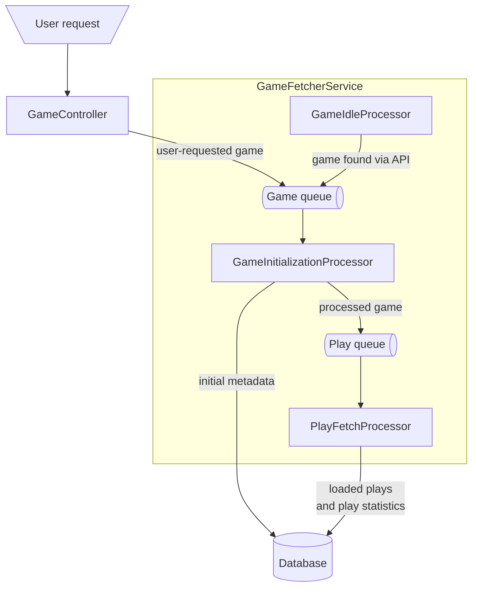

# GameTime

This is a ASP.NET web service written in F# that fetches play times for games
on [BoardGameGeek](https://boardgamegeek.com) and calculates the percentiles for those times at different play counts.

ASP.NET is used in minimal API mode using [Giraffe.ViewEngine](https://giraffe.wiki/view-engine) to keep the artifact
size down. [Dapper.FSharp](https://github.com/Dzoukr/Dapper.FSharp) is used with SQLite for persistence.

Styling is done with [Pico CSS](https://picocss.com/) because it gives me
pretty decent UI without a build or using too much bandwidth.

Deployment is done to Fly.io using Make and Docker in [the cubes-in-space
repo](https://github.com/TJSomething/cubes-in-space/), which deploys this app
to https://cubesin.space/gametime/, behind Haproxy.

## Architecture

GameTime asynchronously fetches games in the background in response to user
requests. When there are no games queued, it uses the BGG API to find games
that haven't been loaded or are out of date.

There is also separately the `ReportManager` and `ReportProcessor` services,
which are used to run long-running SQL queries in the background. Since this is
plausibly dangerous, this feature is authenticated. Account creation,
authorization, and authentication is done with ASP.NET's built-in identity
providers, but `FakeEmailSender` is used to print the account activation link
to the log, where a server admin can trigger it. This gives me bootstrapped
closed account registration without needing to build any UI or permission
system for it. I didn't really want to build that much functionality when it's
unlikely I'll need more than one account.

## Configuration

Application-specific settings are set with settings.json or with the `GAMETIME_` environment variable prefix:

- `sqliteConnectionString`: a connection string for SQLite (default: `Data Source=GameTime.db;Foreign Keys=True`)
- `PathBase`: the base path for URLs (default is the empty string)
- `CacheSizeBytes`: the size of the cache in bytes, used primarily for authentication
- `BggFrontendToken`: the token for the frontend to call BGG
- `BggBackendToken`: the token for the backend to call BGG
